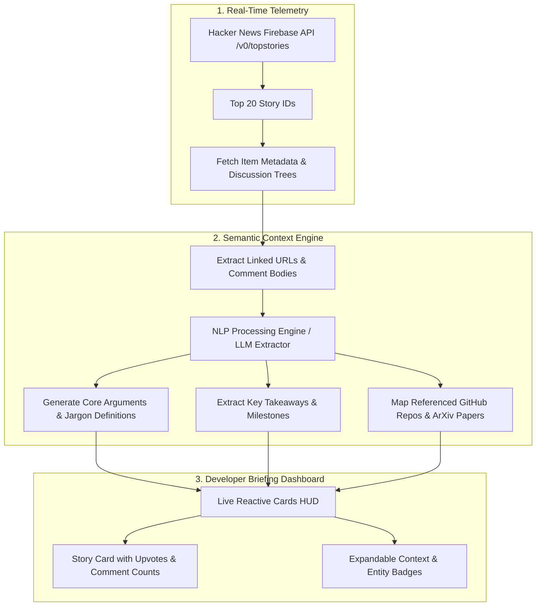

<div align="center">

# 📰 HN INSIGHTS & CONTEXT EXPANDER
### Automated AI Intelligence Layer & Semantic Summarizer for Hacker News Top Stories

[](https://dulcet-eclair-c91d88.netlify.app)
[](https://developer.mozilla.org/en-US/docs/Web/JavaScript)
[](https://github.com/HackerNews/API)
[](https://tailwindcss.com/)
[](https://opensource.org/licenses/MIT)

<p align="center">
  <b>HN Insights & Context Expander</b> transforms the high-volume firehose of Hacker News into an executive-level briefing dashboard. Automatically synchronizing with the official Hacker News Firebase endpoints, it enriches the top 20 trending discussions with deep background context, linked article key takeaways, entity mapping, and jargon breakdowns.
</p>

[🚀 Live Demo](https://dulcet-eclair-c91d88.netlify.app) • [✨ Key Features](#-key-features) • [🏛️ Intelligence Pipeline](#-intelligence-pipeline-architecture) • [🛠️ Tech Stack](#️-tech-stack) • [📦 Quickstart](#-quickstart-guide) • [📁 Structure](#-project-structure)

</div>

---

## 🌟 Key Features

* **🔥 Real-Time Top 20 Synchronization**: Connects directly to the official Y Combinator Hacker News Firebase REST API to track the top-ranking discussions in real time.
* **🧠 Context Expansion Layer**: Deconstructs dense technical articles into structured overviews, clarifying domain-specific jargon and historical context.
* **💡 Executive Takeaway Summaries**: Distills long community comment threads into actionable bullet points, debate summaries, and consensus conclusions.
* **🗺️ Semantic Entity & Repository Mapping**: Automatically identifies and cross-links mentioned open-source repositories, academic papers, and technical specifications.
* **⚡ High-Speed Browser HUD**: Clean, responsive layout designed for instant scanning across desktop, tablet, and mobile screens.

---

## 🏛️ Intelligence Pipeline Architecture



---

## 🛠️ Tech Stack

| Layer | Technologies |
| :--- | :--- |
| **Frontend Application** | Modern JavaScript (ES6+), HTML5, CSS3 |
| **Styling & Layout** | Tailwind CSS with responsive dark-mode styling |
| **Data Ingestion** | Official Hacker News Firebase API (`https://hacker-news.firebaseio.com/v0/`) |
| **Hosting & CI/CD** | Netlify Continuous Deployment |

---

## 🚀 Quickstart Guide

### 1. Clone the Repository
```bash
git clone https://github.com/harinarayana1457-cmyk/hackernews_evo.git
cd hackernews_evo
```

### 2. Launch Locally
Because the application is built with zero runtime compile requirements, you can preview it immediately:
* **Option A**: Open `hackr/index.html` directly in your web browser.
* **Option B**: Run a lightweight local HTTP server:
  ```bash
  npx serve hackr
  # Or via Python
  python -m http.server --directory hackr 3000
  ```
Visit `http://localhost:3000` to interact with the dashboard.

---

## 📁 Project Structure

```text
hackernews_evo/
├── hackr/
│   ├── index.html            # Main briefing dashboard layout & UI structure
│   ├── app.js                # Firebase API client, data formatting, and UI event logic
│   └── styles.css            # Dark aesthetic styles, responsive layout rules
├── .gitignore                # Repository ignore rules
└── README.md                 # Project documentation
```

---

## 🔗 Connect & Links

* **Live Demo**: [HN Context App on Netlify](https://dulcet-eclair-c91d88.netlify.app)
* **Author**: [Hari Narayana (@harinarayana1457-cmyk)](https://github.com/harinarayana1457-cmyk)
* [](https://www.linkedin.com/in/hari-narayana-035ba1389/)
